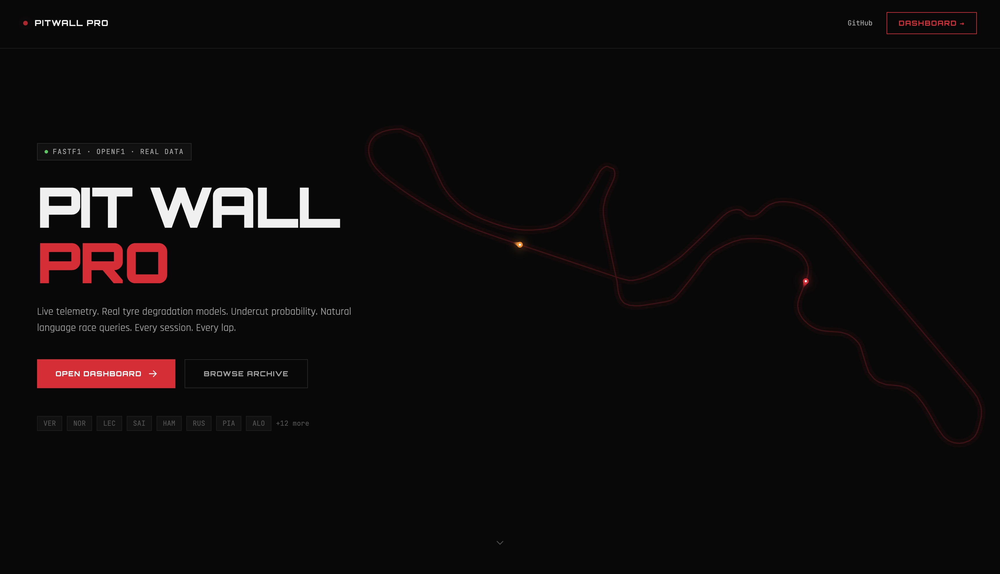
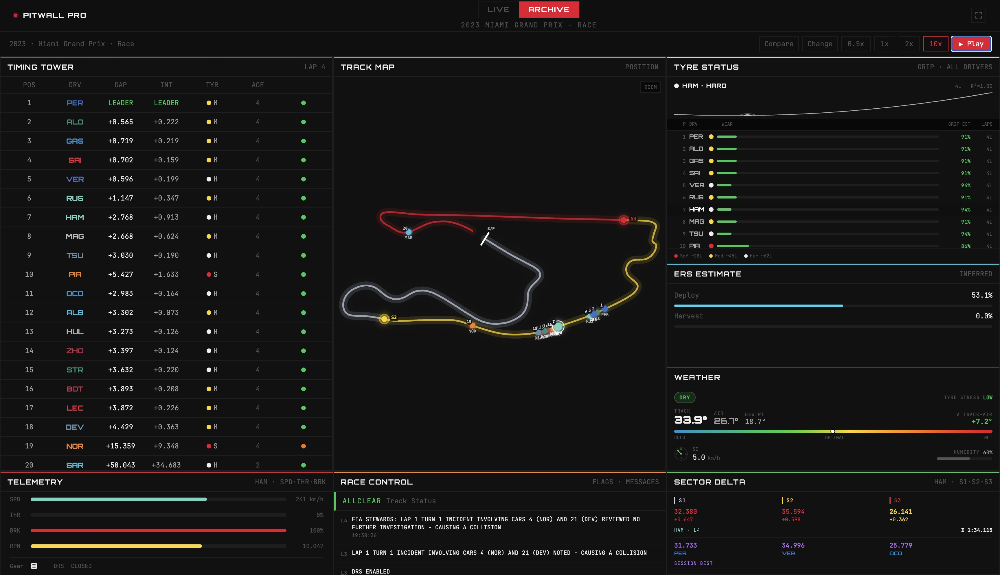

# PitWall Pro

A professional F1 telemetry and strategy dashboard — live timing, archive session replay, tyre degradation models, ERS inference, driver comparison, and circuit visualisation.

**Live demo:** [pitwall-pro-one.vercel.app](https://pitwall-pro-one.vercel.app)

---

## Screenshots

### Landing Page


### Dashboard — 2023 Miami GP Race Replay


---

## Features

| Feature | Status |
|---|---|
| Live timing tower (position, gap, lap time, tyre, sector) | ✅ Live |
| Archive replay (2018–2024) at 0.5×/1×/2×/10× speed | ✅ Live |
| Replay play/pause and speed control | ✅ Live |
| Track map with animated car positions | ✅ Live (archive only — see Limitations) |
| Tyre wear bars with compound-normalised grip estimate | ✅ Live |
| Tyre degradation curve (quadratic polynomial fit) | ✅ Live |
| ERS deployment/harvest inference | ✅ Live |
| Race control messages and track status | ✅ Live |
| Circuit weather forecast for upcoming round | ✅ Live |
| Driver comparison — lap delta chart | ✅ Live |
| Driver comparison — sector bests | ✅ Live |
| Driver comparison — tyre stint timeline | ✅ Live |
| Driver comparison — telemetry overlay (speed/throttle/brake/gear) | ✅ Live |
| Championship standings (WDC + WCC) | ✅ Live |
| Last race results + podium | ✅ Live |
| Upcoming grand prix card | ✅ Live |
| Live track map with real-time car positions | ⚠️ Partial (Position.z locked — see Limitations) |
| Undercut window probability | 🗓 Planned |
| Natural language strategy query (Claude API) | 🗓 Planned |

---

## Architecture

```
┌─────────────────────────────────────────────────────────┐
│                   Browser (Next.js 15)                  │
│                                                         │
│  /              Landing page                            │
│  /dashboard     Main telemetry dashboard                │
│  /dashboard/compare   Driver comparison                 │
│                                                         │
│  Zustand store ←── useReplaySocket (WebSocket client)   │
│  src/lib/api.ts (REST client)                           │
└────────────────┬───────────────────────────────────────┘
                 │  REST + WebSocket (NEXT_PUBLIC_API_URL)
┌────────────────▼───────────────────────────────────────┐
│              FastAPI Backend (Railway)                  │
│                                                         │
│  /api/archive/*    REST catalogue + replay WebSocket    │
│  /api/live/stream  Live SignalR proxy WebSocket         │
│  /api/schedule/*   Calendar, standings, last race       │
│  /health           Redis ping                           │
│                                                         │
│  FastF1 ──── local disk cache (cache/fastf1/)           │
│  OpenF1 API ─ schedule + session metadata               │
│  Jolpica/ergast ── standings fallback                   │
│  Redis ──────── session metadata TTL cache              │
└────────────────────────────────────────────────────────┘
```

**WebSocket frame protocol** — both archive replay and live stream share the same frame contract:

| Frame type | Payload |
|---|---|
| `lap` | Full lap snapshot: timing, tyre deg, ERS, undercut, positions |
| `tel_update` | Intra-lap car data (speed, throttle, brake, gear, DRS) |
| `timing_update` | Gap/interval deltas between car positions |
| `position_update` | Car XY coordinates for track map |
| `circuit_outline` | SVG-ready circuit path + sector boundaries |
| `rc_message` | Race Control message |
| `track_status_update` | Green / SC / VSC / Red Flag |
| `position_recalibrated` | Leader-trace offset correction |
| `end` | Replay complete |
| `no_session` | No active live session |
| `error` | Backend error detail |

---

## Tech Stack

### Frontend

| | |
|---|---|
| Framework | Next.js 15 (App Router) |
| Language | TypeScript |
| Styling | Tailwind CSS v3 |
| State | Zustand |
| Transport | native WebSocket + fetch |

### Backend

| | |
|---|---|
| Framework | FastAPI |
| Runtime | Python 3.11 |
| F1 data | FastF1 3.4 (archive + live SignalR) |
| Live schedule | OpenF1 API + Jolpica/ergast fallback |
| Analytics | NumPy, SciPy (tyre deg quadratic fit, ERS inference) |
| Cache | Redis (session metadata TTL), FastF1 local disk cache |
| Server | Uvicorn |

---

## Local Development

### Prerequisites

- Node.js 20+
- Python 3.11+
- Redis running locally (`redis-server`)

### Frontend

```bash
# Install dependencies
npm install

# Create env file (see Environment Variables below)
cp .env.local.example .env.local

# Start dev server
npm run dev
# → http://localhost:3000
```

### Backend

```bash
cd backend

# Create and activate virtualenv
python -m venv .venv
source .venv/bin/activate   # Windows: .venv\Scripts\activate

# Install dependencies
pip install -r requirements.txt

# Create env file
cp .env.example .env

# Start server
uvicorn main:app --reload --host 0.0.0.0 --port 8000
# → http://localhost:8000
```

FastF1 will download session data to `backend/cache/fastf1/` on first use. The 2020 Austrian GP is pre-cached.

---

## Environment Variables

### Frontend (`.env.local`)

| Variable | Description | Example |
|---|---|---|
| `NEXT_PUBLIC_API_URL` | Full URL of the FastAPI backend | `http://localhost:8000` |

### Backend (`.env`)

| Variable | Description | Default |
|---|---|---|
| `REDIS_URL` | Redis connection string | `redis://localhost:6379` |
| `FASTF1_CACHE_DIR` | Path to FastF1 local cache | `./cache/fastf1` |
| `CORS_ORIGINS` | Comma-separated allowed origins (unused after hardcoded list — kept for reference) | `http://localhost:3000` |

---

## Data Sources & Limitations

### FastF1 (archive telemetry)

FastF1 sources data from the Ergast API and F1's own timing feeds. Full telemetry (car data, GPS positions) is available for **2018–2024**. The 2025 season feed changed format and **2026 data is not yet accessible**.

### OpenF1 (live session metadata)

OpenF1 provides live session keys, driver lists, and schedule data. During an active session, the API returns **401 Unauthorized** for some endpoints (`OpenF1LockedError`) — the backend falls back to FastF1/ergast for those calls.

### Live car positions (`Position.z`)

Real-time GPS car coordinates (`Position.z` in the FastF1 SignalR feed) have been **locked behind F1 TV authentication since August 2025**. The live track map cannot display animated positions until this restriction is lifted. Archive replay is unaffected — it uses recorded GPS data from FastF1.

### Tyre degradation model

Quadratic polynomial regression (`lap_time = a·age² + b·age + c`) fitted per driver per compound per stint. Requires a minimum of 4 clean laps to produce a reliable curve; outliers (safety car laps > 110% of median) are filtered before fitting.

---

## Roadmap

- [ ] Live track map (blocked on F1 TV Position.z auth)
- [ ] Undercut window probability card on dashboard
- [ ] Natural language strategy Q&A via Claude API ("Who should pit first?")
- [ ] Driver head-to-head comparison chart over a full season
- [ ] Tyre strategy optimiser (pit window calculator)
- [ ] Mobile-optimised layout improvements

---

## Deployment

- **Frontend** — Vercel (auto-deploy from `main`). Set `NEXT_PUBLIC_API_URL` in Vercel project settings.
- **Backend** — Railway. Set `REDIS_URL` in Railway environment variables. Redis is provisioned as a Railway add-on.

---

## License

MIT
